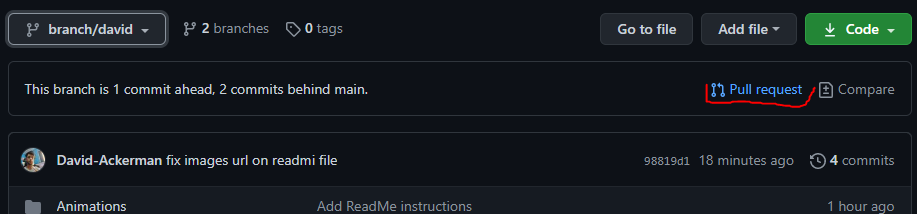

# Smaug1

Para usar esse projeto em conjunto com o git

## Primeiro baixe o github para desktop ou o git cli clicando nos links abaixo

[Github para desktop](https://desktop.github.com/)

[Git CLI](https://git-scm.com/downloads)

## Exemplo usando o git cli

### Baixando o projeto

- Va para o site do [Projeto](https://github.com/David-Ackerman/Smaug1) e clique no botão de download e copie a url que é exibida conforme a imagem abaixo.

- Abra seu terminal do git na pasta em que você deseja deixar o projeto e digite o comando `git clone yourUrl` como no exemplo abaixo

- Entre na pasta que foi adicionada e troque para uma nova branch em seguida, usando os comandos `cd smaug1` e `git checkout -b branch/yourBranchName`, use as imagens abaixo como exemplo

- Abra o projeto e use normalmente

### Salve suas alterações no repositorio

- Quando quiser salvar suas alterações no repositorio abra novamente o terminal do git na pasta do projeto e siga os passsos abaixo

  - Adicione suas alterações com o comando `git add .`

    

  - faça o commit delas (cria um ponto de alteração no repositorio) com o comando `git commit -m "your message here"`

    

  - Faça o push das suas alterações com o comando `git push`, esse comando envia suas alterações para a pagina do projeto, se for seu primeiro push o git vai sugerir um comando para usar no lugar do push, execute ele como o exemplo abaixo

    
    

### Envie suas alterações para a branch principal do projeto

- Para essa etapa é necessario abrir novamente a pagina do projeto no github e selecionar a branch que você criou

  

- Abra um pull request clicando no botão conforme a imagem

  

- De um titulo para o seu pull request e caso ache necessario adicione alguns comentarios no campo abaixo do titulo

  

- Com isso peça para seus colegas de equipe olharem seu pull request, e caso eles aprovem suas alterações vai ir para a branch principal do projeto :)
